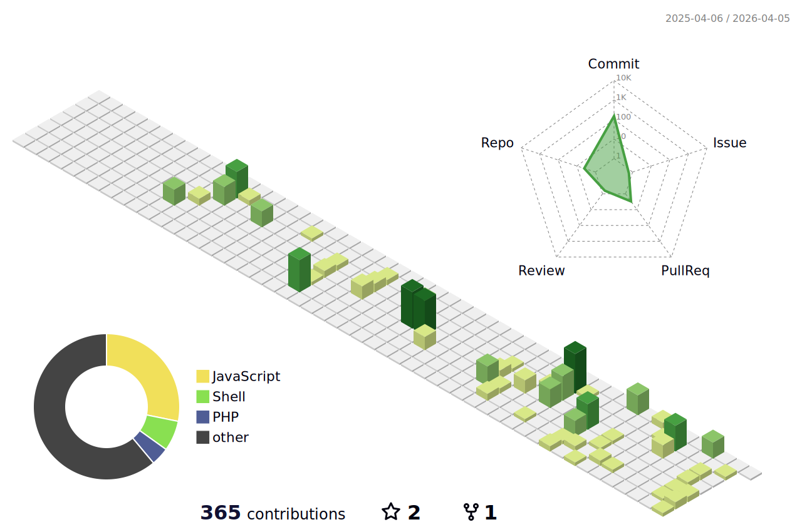

<div align="center">

# 👋 Hey, I'm Matthias

**Backend Developer**  
Building scalable applications with a passion for DevOps and tinkering with software

<!--[](https://linkedin.com/in/yourprofile)-->
<!--[](mailto:your.email@example.com)-->

</div>

---

<div align="center">


</div>

---

## 🛠️ Tech Stack

| Category          | Technologies                                                                                                                     |
|-------------------|----------------------------------------------------------------------------------------------------------------------------------|
| **Programming**   |     |
| **Frontend**      |  |
| **Backend**       |      |
| **DevOps**        |   |
| **Tools**         |     |
| **OS**            |  |

---

## 💼 What I'm Working On

```php
<?php

class Developer
{
    public string $name = "Matthias";
    public array $focus = [
        "Backend Development",
        "DevOps Exploration", 
        "Software Tinkering"
    ];
    
    public function getCurrentStack(): array
    {
        return [
            'backend' => ['Symfony', 'Laravel', 'Sulu'],
            'database' => ['MySQL'],
            'devops' => ['Docker', 'Git']
        ];
    }
}
```

<summary>🔧 What I Build & Explore</summary>

### Backend Development
- Building robust APIs with Symfony and Laravel
- Implementing Sulu CMS solutions
- Database design and optimization with MySQL
- RESTful API architecture and best practices

### DevOps & Tinkering
- Containerization experiments with Docker
- CI/CD workflow automation
- Development environment optimization
- Exploring new tools and technologies

---

## 📈 GitHub Stats
<div align="center">


<picture>
  <source media="(prefers-color-scheme: dark)" srcset="./profile-3d-contrib/profile-night-green.svg">
  <source media="(prefers-color-scheme: light)" srcset="./profile-3d-contrib/profile-gitblock.svg">
  
</picture>

</div>

---

<div align="center">


</div>
