# 📊 GitHub Statistics

[← Back to Profile](README.md) | [Overview](#-overview) | [Languages](#-languages) | [Activity](#-activity) | [Achievements](#-achievements) | [Community](#-community--engagement)

---

---

## 📈 Overview

<picture>
  <source media="(prefers-color-scheme: dark)" srcset="https://github-readme-stats.vercel.app/api?username=matthiasseghers&show_icons=true&theme=dark&hide_border=true&include_all_commits=true&count_private=true">
  <source media="(prefers-color-scheme: light)" srcset="https://github-readme-stats.vercel.app/api?username=matthiasseghers&show_icons=true&theme=default&hide_border=true&include_all_commits=true&count_private=true">
  
</picture>

---

## 🔥 Contribution Streak

<picture>
  <source media="(prefers-color-scheme: dark)" srcset="https://github-readme-streak-stats.herokuapp.com/?user=matthiasseghers&theme=dark&hide_border=true">
  <source media="(prefers-color-scheme: light)" srcset="https://github-readme-streak-stats.herokuapp.com/?user=matthiasseghers&theme=default&hide_border=true">
  
</picture>

---

## � Activity

<picture>
  <source media="(prefers-color-scheme: dark)" srcset="./profile-3d-contrib/profile-night-green.svg">
  <source media="(prefers-color-scheme: light)" srcset="./profile-3d-contrib/profile-gitblock.svg">
  
</picture>

---

## 💻 Languages

---

## 🏆 Achievements

---

## � Community & Engagement

---

## 🎯 Development Insights

---

## 📦 Projects & Code

---

## ⭐ Stars & Interests

---

## 💻 Coding Challenges

---

## 📌 Additional Information

### Profile Views

---

### 📝 About These Metrics

_These statistics are automatically generated using [GitHub Metrics](https://github.com/lowlighter/metrics) and various GitHub APIs. The visualizations provide comprehensive insights into coding activity, contributions, and community engagement._

**Last Updated:** Automatically updated weekly via GitHub Actions

---

**[⬆ Back to Top](#-github-statistics)** | **[← Back to Profile](README.md)**

